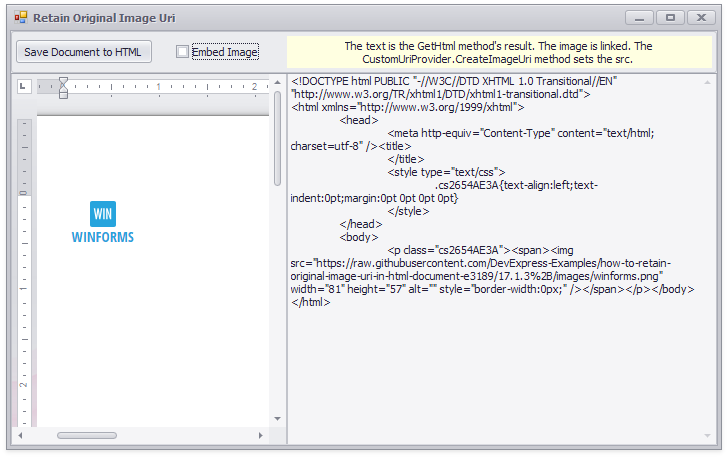

<!-- default file list -->
*Files to look at*:

* [CustomUriProvider.cs](./CS/HTML_Export_ImageSourceExample/CustomUriProvider.cs) (VB: [CustomUriProvider.vb](./VB/HTML_Export_ImageSourceExample/CustomUriProvider.vb))
* [Form1.cs](./CS/HTML_Export_ImageSourceExample/Form1.cs) (VB: [Form1.vb](./VB/HTML_Export_ImageSourceExample/Form1.vb))
<!-- default file list end -->
# How to retain original image URI in HTML document

This example demonstrates how to use the [DocumentImage.Uri](https://docs.devexpress.com/OfficeFileAPI/DevExpress.XtraRichEdit.API.Native.DocumentImage.Uri) property to set the image's **src** attribute when a document is saved in HTML format.

The project implements a custom class with the **IUriProvider** interface and registers it as the **IUriProviderService** provider.

API in this example:

* [IUriProvider](https://docs.devexpress.com/OfficeFileAPI/DevExpress.Office.Services.IUriProvider) interface
* [IUriProviderService](https://docs.devexpress.com/OfficeFileAPI/DevExpress.Office.Services.IUriProviderService) interface
* [IUriProviderService.RegisterProvider](https://docs.devexpress.com/OfficeFileAPI/DevExpress.Office.Services.IUriProviderService.RegisterProvider(DevExpress.Office.Services.IUriProvider)) method
* [RichEditControl.GetService](https://docs.devexpress.com/WindowsForms/DevExpress.XtraRichEdit.RichEditControl.GetService.overloads) method
* [DocumentImageSource.FromUri](https://docs.devexpress.com/OfficeFileAPI/DevExpress.XtraRichEdit.API.Native.DocumentImageSource.FromUri(System.String-System.ComponentModel.Design.IServiceContainer)) method
* [SubDocument.Images](https://docs.devexpress.com/OfficeFileAPI/DevExpress.XtraRichEdit.API.Native.SubDocument.Images)
* [SubDocument.GetHtmlText](https://docs.devexpress.com/OfficeFileAPI/DevExpress.XtraRichEdit.API.Native.SubDocument.GetHtmlText.overloads)

**See also:**

* [Import and Export](https://docs.devexpress.com/WindowsForms/9333)
